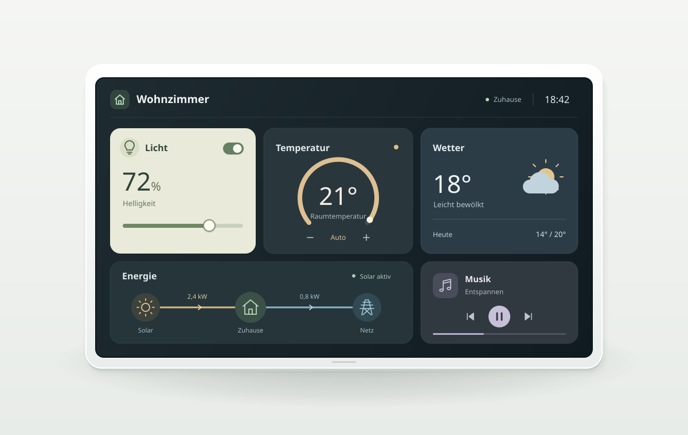
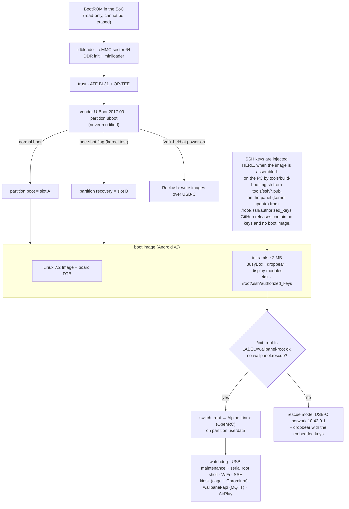
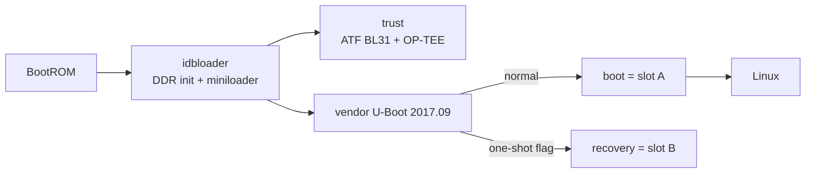
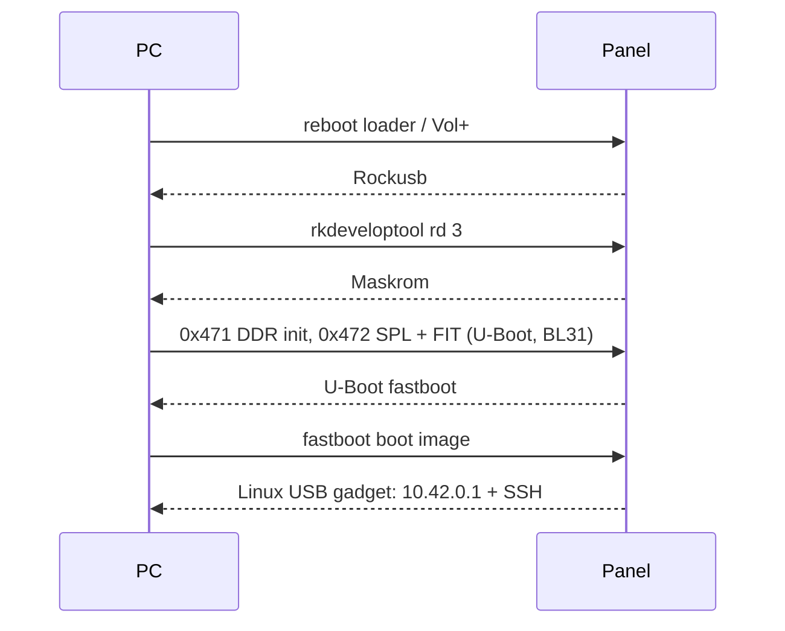

# iiyama ProLite TW2424AS – Linux wallpanel

<p align="center"></p>

The iiyama ProLite TW2424AS is a 24" touch panel PC with a Rockchip RK3399, sold with Android 12 and
stuck on the March 2022 security patch. This project replaces Android with current mainline Linux
(kernel.org 7.2 + Alpine) and turns it into a dedicated Home Assistant wallpanel.

**Why:** a maintained kernel and OS instead of an abandoned Android · a smooth dashboard (GPU raster,
~57 fps median) · native HA integration via MQTT discovery, no Fully Kiosk · only SSH and AirPlay exposed ·
A/B kernel updates and a rescue path that never touches the bootloader.
**Trade-offs:** no Android apps · HDMI-in unsupported · audio and Ethernet not fully tested ·
installing wipes the Android user data (reversible from the backup).

Specifications and photos: see the manufacturer page, [iiyama ProLite TW2424AS-W1](https://iiyama.com/gl_en/products/prolite-tw2424as-w1/).

## Supported hardware

| Component | Hardware | Linux |
|---|---|---|
| SoC, RAM, storage | RK3399 (2× A72 + 4× A53), 4 GB LPDDR4, 32 GB eMMC | ✅ incl. CPU DVFS, thermal |
| Display | 1920×1080, DSI → TC358775 → dual LVDS, mounted 180° | ✅ own panel driver, backlight |
| Touch | SiliconWorks SiW HID (USB), 10 points | ✅ rotated with the display |
| Keys | Power, Vol± (ADC) | ✅ volume overlay, power toggles display |
| WiFi / Bluetooth | AMPAK AP6256 (BCM43456 / BCM4345C5) | ✅ vendor firmware, power save off |
| GPU / video | Mali-T860 MP4 / rkvdec, hantro | ✅ Panfrost (GLES 3.1), V4L2 |
| Audio | ES8316, HDMI audio | ✅ cards present, playback untested |
| Microphones | 2 digital mics + echo reference on ES7210 | ✅ own driver, capture on card 0 (channels 2–5); ALSA `default` = the mics (Assist in the browser) |
| Ethernet | GMAC RGMII + Motorcomm YT8511 | ✅ driver, link untested |
| RTC, HDMI out | HYM8563, dw-hdmi | ✅ |
| HDMI in | RK628 (HDMI → CSI) | ❌ no mainline driver |

<details><summary>Hardware details (PMIC, GPIOs, sources)</summary>

Photos: see the [manufacturer page](https://iiyama.com/gl_en/products/prolite-tw2424as-w1/).

- PMIC RK808 + SYR827 (vdd_cpu_b) + SYR828 (vdd_gpu); eMMC HS400
- Display: 4 DSI lanes, 137.86 MHz pixel clock, 59 Hz. Backlight PWM2, enable gpio1 PB2 (active low),
  LCD rails gpio1 PA1/PA3. The vendor DT's DSI "reset" GPIO is the TC358775 reset.
- Touch USB `29bd:9b01`, power gpio0 PB0. Bluetooth on UART0. USB-C: FUSB302, CDN-DP.
- Also on board: accelerometer.
- Audio: ES8316 and ES7210 share i2s0 (MCLK/BCLK/LRCK) and drive separate SDI lines, so card 0
  (`iiyama-tw2424as`) is one multi-codec link. Capture channels: 0–1 ES8316 (headset mic), 2–3 the
  two digital microphones (PDM on ES7210 MIC1P), 4–5 echo reference (loudspeaker signal on ES7210
  MIC3/MIC4), 6–7 unused. Recording: `arecord -D hw:0,0 -c 6 -r 48000 -f S32_LE mic.wav`. Gains:
  `Mic Array DMIC12` (6 dB steps, 12 dB at boot), `Mic Array MIC3/MIC4` (echo reference, 24 dB),
  `Mic Array ADCn` (digital volume per channel).
- Corrections to the vendor DT: WiFi/BT is AP6256, not AP6335; the panel is mounted upside down.
- All values come from the live device tree of the vendor firmware (`tools/debug/dtshow.py` resolves
  phandles/GPIOs); derived results in [`docs/analysis/`](docs/analysis/).
</details>

## Power consumption

Measured at the wall (smart plug), dashboard running:

| State | Power |
|---|---|
| Display on, backlight 255 / 200 / 50 / 1 | 24.1 / 21.2 / 14.0 / 11.8 W |
| Standby (HA switch "Display" off: backlight off, animations paused) | ~6.4 W |
| Output completely off (for comparison; needs a modeset + bridge re-init on wake) | 5.9 W |

Standby wakes instantly without a modeset (no artefacts); a touch or the power key wakes it.

## 24/7 operation

Built to run for years without attention. The eMMC (Samsung, 29 GiB, TLC) is the part that wears, so
everything written constantly lives in RAM:

| Written to | eMMC writes / day | 10 years, share of eMMC endurance* |
|---|---|---|
| Stock setup (Chromium profile, logs on eMMC) | 2.1–3.3 GB | 50–120 % |
| Chromium HTTP/code cache in RAM | 1.4 GB | 35–50 % |
| + Chromium histogram files (`BrowserMetrics/*.pma`, 4 MiB every 30 s) in RAM, logs and `/tmp` in RAM | ~0.1–0.3 GB (estimate) | < 10 % |

\* ~1000 P/E cycles, write amplification 2–3. Measured on the whole block device (`/proc/diskstats`).

- **RAM file systems**: `/tmp` (256 MiB), `/var/log` (32 MiB, syslog capped at 3 MiB, logs trimmed every
  15 min), Chromium cache and histograms in `/run`. The Chromium profile (HA login, permissions) and the
  settings stay on the eMMC.
- **File system**: `noatime,commit=60`, weekly `fstrim`, `/` remounted read-only on shutdown; `fsck -y`
  never stops the boot, so SSH and the USB maintenance port stay reachable.
- **Stays running**: hardware watchdog (30 s), panic on soft/hard lockup (the watchdog
  reboots), OpenRC respawns every service, the kiosk reloads when memory runs full while dark, optional
  daily reboot (HA switch).
- **Health**: `cat /sys/class/mmc_host/mmc0/mmc0:0001/life_time` shows the eMMC wear estimate
  (`0x01` = 0–10 % used); temperature 45–51 °C with no throttling (trip points 70/75/95 °C).

## Partitions

Only three partitions change; bootloader, `misc` and Android `super` stay untouched.

| Partition | Wallpanel |
|---|---|
| `boot` | 🔵 Linux slot A – boots on every power-on |
| `recovery` | 🔵 Linux slot B – one-shot update test |
| `userdata` | 🔴 ext4 `wallpanel-root`: Alpine Linux + apps |

<details><summary>Full eMMC layout</summary>

| Partition | Size | Content | Wallpanel |
|---|---|---|---|
| idbloader (sector 64) | – | DDR init + miniloader | unchanged |
| `security`, `uboot`, `trust` | 4 MB each | security data, vendor U-Boot 2017.09, ATF + OP-TEE | unchanged – **rescue: Vol+ → Rockusb** |
| `misc` | 4 MB | Android boot command (BCB) | unchanged, stays empty |
| `dtbo`, `vbmeta` | 4 / 1 MB | Android DT overlay, AVB | unchanged |
| `boot` | 45 MB | Android kernel | Linux slot A |
| `recovery` | 96 MB | Android recovery | Linux slot B |
| `backup`, `cache`, `metadata`, `update`, `baseparameter` | 0.4 GB | Android | unchanged |
| `super` | 5 GB | Android system/vendor | unchanged (for rollback) |
| `userdata` | 23 GB | Android data | ext4 `wallpanel-root` |
</details>

## Apps

| App | What it does | Network |
|---|---|---|
| [`wallpanel-kiosk`](apps/wallpanel-kiosk/) | Chromium fullscreen (cage/Wayland) with the Home Assistant dashboard: GPU raster, locked to the HA URL, per-card isolation for smooth animations, restarts on crash, runs unprivileged | outbound to HA; DevTools 9222/tcp localhost only |
| [`wallpanel-api`](apps/wallpanel-api/) | Home Assistant integration via MQTT discovery – display on/off (instant standby) + lock, brightness, night shift, volume, home page, return to home page after N min dark, auto reboot with time, reload/restart/reboot buttons, CPU/memory/disk/temperature/WiFi sensors; keeps the kiosk fullscreen and logged in, reloads it when memory runs full while dark; Vol± with on-screen overlay, power key toggles standby | outbound MQTT, no open port |
| [`wallpanel-airplay`](apps/wallpanel-airplay/) | AirPlay 1 speaker (shairport-sync + avahi) for iPhone/Mac and Home Assistant via Music Assistant; plays through the shared dmix next to Chromium, AirPlay volume = panel volume (same DAC control and scale), optional password | mDNS 5353/udp, 5000/tcp, 6001–6010/udp |

## Services and ports

| Service | Purpose | Port |
|---|---|---|
| `dropbear` | SSH as root, key or password | 22/tcp |
| `wallpanel-usb`, `wallpanel-console` | USB-C maintenance: network + serial root shell | 10.42.0.1, `/dev/ttyACM0` |
| `wpa_supplicant`, `chronyd`, `seatd` | WiFi (retries forever), time, seat for the kiosk | – |
| `wallpanel-airplay`, `avahi-daemon`, `dbus` | AirPlay receiver, its mDNS announcement (wlan0/eth0 only) | 5000/tcp, 6001–6010/udp, 5353/udp |

**Maintenance access is open by design** – so a broken panel can always be rescued:
- USB-C serial console (`/dev/ttyACM0`) is an **unauthenticated root shell**: physical access = root.
- SSH (WiFi and USB-C) accepts key **and** password – set a strong `ROOT_PASSWORD`.
- `tools/tssh` disables host-key checking (convenience for the point-to-point USB link).
- MQTT is unencrypted on 1883 (`wallpanel-api` has no TLS): keep panel and broker on a trusted network/VLAN.
- AirPlay (`wallpanel-airplay`): anyone who reaches ports 5000/tcp + 6001–6010/udp can play audio unless
  `AIRPLAY_PASSWORD` is set; AirPlay 1 is unencrypted. Restrict the ports to the HA host and your clients.

## How the panel boots



The bootloader chain is Rockchip's and stays untouched; everything from the boot image on is ours. A kernel
update only ever rewrites slot B (and, after a passed self-test, slot A); the root file system and the
bootloader are never part of it.

## Install and update

<details><summary><b>Install</b> – from Android, without touching the bootloader</summary>

Prerequisites: backup of all partitions except userdata in `dumps/` (`tools/backup.sh`, SHA256-checked
against the device); `tools/local.env` (see *Configuration* below);
udev rule `tools/70-rockchip.rules`.

```sh
./build.sh fetch kernel && ./build.sh kernel      # pinned kernel + patches
./build.sh fetch uboot && ./build.sh uboot        # maskrom RAM loader
./build.sh helpers && ./build.sh image            # helpers, RAM installer
tools/build-bootimg.sh                            # boot image for boot/recovery
tools/ramboot.sh build/out/boot-test-mainline.img # start the installer in RAM
tools/install.sh                                  # userdata → Alpine + apps, slots A/B
```
The installer overwrites `boot`/`recovery` only if they hold the Android backup or a wallpanel image.
It installs our cage ([`system/cage/`](system/cage/)) and gamma helper ([`system/wallpanel-gamma/`](system/wallpanel-gamma/))
from `build/out/` or builds them in the new system first.
Apps and overlay later without reinstalling: `tools/sync-apps.sh`.
</details>

<details><summary><b>Configuration</b> – <code>tools/local.env</code> (example)</summary>

All device- and user-specific settings live in one gitignored file, `tools/local.env` (copy of
[`tools/local.env.example`](tools/local.env.example)); `install.sh` and `sync-apps.sh` write the device's
`/etc/wallpanel/wallpanel.conf` and WiFi from it. Placeholder values:

```sh
# Copy to tools/local.env (gitignored) and fill in. Shell syntax: put values with spaces or special
# characters in single quotes (a single quote itself is not supported); comments on their own lines.
# install.sh / sync-apps.sh write the device's /etc/wallpanel/wallpanel.conf and WiFi from it.

# --- device ---
# name in Home Assistant (MQTT device) and for AirPlay
DEVICE_NAME='Wallpanel'
# local time zone of the maintenance/reboot time
TIMEZONE='Europe/Berlin'
# root login over SSH/serial in addition to the key (tools/ssh/); empty = key only
ROOT_PASSWORD='change-me'
# display rotation in degrees (default 180 for this panel)
ROTATION=180
# WiFi address of the installed panel, for the tools: WALLPANEL_HOST=$DEVICE_WLAN_IP tools/tssh
DEVICE_WLAN_IP=192.168.1.50

# --- WiFi (WPA-PSK) ---
WIFI_SSID='MyWiFi'
WIFI_PSK='wifi-passphrase'

# --- Home Assistant dashboard (kiosk) ---
HA_URL='https://192.168.1.10:8123/'
# start page of the kiosk; empty = HA_URL
KIOSK_URL='https://192.168.1.10:8123/lovelace/0'
# HA user the kiosk logs in with automatically
KIOSK_USER='wallpanel'
KIOSK_PASSWORD='ha-password'
# a self-signed HA certificate goes to tools/trust/<name>.crt: the kiosk trusts it

# --- MQTT (Home Assistant integration via MQTT discovery) ---
MQTT_HOST=192.168.1.10
MQTT_PORT=1883
MQTT_USER='wallpanel'
MQTT_PASSWORD='mqtt-password'

# --- optional ---
# AirPlay receiver password; empty = none
AIRPLAY_PASSWORD=
# GitHub repository with the signed kernel releases; empty = this project
KERNEL_REPO=

# --- development only (Android backup, RAM boot, lab tools) ---
# adb serial of the panel while it still runs Android
ADB_SERIAL=
# HA login for tools/debug/kiosk/cdp.py
HA_USER=
HA_PASS=
# smart plug for power cycling (tools/debug/shelly.sh)
SHELLY_IP=
# directory of the camera snapshots (tools/debug/snap.sh)
CAM_DIR=
```
</details>

<details><summary><b>Kernel update (A/B)</b> – test in slot B, promote to slot A</summary>

```sh
wallpanel-update install /tmp/wallpanel-boot.img /tmp/wallpanel-modules.tar.gz  # slot B + modules
wallpanel-update test      # boot slot B once (refuses if its modules are missing)
wallpanel-update promote   # slot B works: copy to slot A
```
The test boot is a one-shot register flag (never `misc`), so a power cycle always returns to slot A.
Signed kernel releases from CI (GitHub releases `kernel-*`): `wallpanel-update check` shows them,
`wallpanel-update install-release` downloads and verifies one, assembles the boot image on the panel (with its own
rescue keys), test-boots slot B with an automatic health check and promotes it – or falls back to slot A
([`system/rootfs/`](system/rootfs/) → "Kernel updates").
Alpine itself updates from the update page or with `wallpanel-rw run apk upgrade`. New kernel version: see [`system/kernel/`](system/kernel/).
On the panel: the **update page** (HA switch *Update-Seite anzeigen*, or tap the screen 10× within 4 s) shows
pending packages and kernel releases; the kernel is only ever installed from there, by touch. *Auto-Update Apps*
covers only Chromium and the AirPlay receiver – never other packages or the kernel
([`apps/wallpanel-api/`](apps/wallpanel-api/)).
</details>

## Rollback and rescue

<details><summary><b>Access</b> – SSH (WiFi/USB-C), serial root shell</summary>

`tools/tssh` (USB-C, `10.42.0.1`) or `WALLPANEL_HOST=<ip> tools/tssh`; password: `ROOT_PASSWORD` in
`tools/local.env`. Serial root shell on `/dev/ttyACM0`, independent of network and SSH.
</details>

<details><summary><b>Logs</b> – in RAM, previous boot in pstore</summary>

`/var/log` is a tmpfs (32 MiB) to spare the eMMC: `/var/log/messages` (syslog), `/var/log/wallpanel-*.log`
(services) start empty after every boot. Kernel log of the previous boot (panic, watchdog reset, last
messages before a reboot): `cat /sys/fs/pstore/console-ramoops-0`.

The root file system is read-only (see *24/7 operation*); changes by hand over SSH:
`wallpanel-rw run apk add foo`, or `wallpanel-rw on` … `wallpanel-rw off`.
</details>

<details><summary><b>Update failed</b> – power-cycle → slot A</summary>

Kernels are only tested in slot B, one-shot. Any power cycle (e.g. smart plug) boots slot A again.
</details>

<details><summary><b>No boot / no access</b> – Vol+ → Rockusb → rescue image</summary>

1. USB-C connected, hold **Vol+** while powering on → Rockusb (vendor U-Boot, never modified)
2. `rkdeveloptool wl 0xC800 build/out/wallpanel-boot-rescue.img` (must reach 100%), `rkdeveloptool rd`
3. Rescue system (USB network + SSH): fix with `tools/sync-apps.sh`, write `wallpanel-boot.img` back to `boot`

A broken root file system starts the rescue mode by itself.
</details>

<details><summary><b>Back to Android</b></summary>

`tools/restore-android.sh ssh|rockusb`: restores `boot`/`recovery` from the backup in `dumps/` and wipes
userdata via Android recovery (steps verified, full flow untested).
</details>

## Boot chain

<details><summary>Normal boot, reboot modes</summary>



The vendor U-Boot reads a magic word in `PMUGRF+0x300` that the kernel writes on `reboot <mode>`:

| Mode | Magic | Result |
|---|---|---|
| normal | `0x5242C300` | `boot` |
| `recovery` | `0x5242C303` | `recovery` (used for slot B via `wallpanel-rebootmode`) |
| `bootloader` | `0x5242C309` | U-Boot fastboot (`fastboot boot` does **not** work here) |
| `loader` | `0x5242C301` | Rockusb (`rkdeveloptool`) |

Vol+ at power-on (with VBUS on USB-C) also enters Rockusb. If the BootROM finds no valid idbloader it
enumerates as **Maskrom** (`2207:330c`), which cannot be erased.
</details>

<details><summary>USB-C RAM boot (maskrom, no eMMC writes)</summary>



`tools/ramboot.sh [image]` runs the whole chain. Needed for it: a mainline U-Boot in RAM (the vendor
`fastboot boot` only resets); an SPL fix because the rkbin DDR init overwrites the BootROM's "booted from
USB" word (`system/boot/patches/0001`); a mainline load-address profile in `mkrkboot.py` (`system/rootfs/overlay/usr/lib/wallpanel/boot/`). The RAM
U-Boot has no flash, UMS, Rockusb, env-save or MMC-write support compiled in.
</details>

## Findings

<details><summary>Bugs found and fixed during the port</summary>

- **TC358775 needs the DSI HS clock in the right order**: register writes (DSI generic long writes, no I2C)
  only latch in LP mode while the HS clock runs, started *after* the bridge reset is released. Mainline
  starts the clock before `panel prepare`, so the panel driver releases the reset once at probe.
- **Vendor U-Boot** boots our kernel from `boot`/`recovery` (Android image v2 + resource DTB, DT built with
  `-@` for the vendor DTBO) but hangs on `Image.gz` → uncompressed kernel, trimmed to RK3399 (41 → 25 MB).
- **Android `reboot recovery`** writes a persistent command into `misc` → then *always* boots recovery.
  Test boots only via the one-shot register flag.
- **Rockusb reads** return `0xcc` above ~32 MiB (writes are fine); `rkdeveloptool wl` can stop at "00%"
  without an error – always check for 100%.
- **WiFi**: brcmfmac SDIO errors (`CMD53 -110`) with power save → `power_save off`: zero errors.
  The kernel has no wireless extensions, so RSSI comes from nl80211.
- **Chromium**: GPU raster via ANGLE → Panfrost; the bottleneck was paint. `contain` + own layer per
  `ha-card`: 18 → 38 fps. The energy-distribution card uses SMIL SVG animations (main thread).
- **Maintenance access**: dropbear `-w` blocks root login – key *and* password are allowed now; the
  serial console getty exits when the host closes the port, so it is supervised.
- **ES7210 microphone array**: no mainline driver, so a new one (register sequences from the vendor
  driver, bits from the datasheet). The microphones are digital (PDM data on MIC1P, `DMIC_CLK`):
  the analog MIC1/MIC2 inputs only show PGA noise; `0x10` DMIC mode for ADC1/2 is needed. MIC3/MIC4
  are not microphones but a loopback of the loudspeaker signal. The BSP's MIC power value `0x0F`
  (regs `0x4B`/`0x4C`) switches the ADCs off. On the shared link the core also sends playback mute
  requests to the ES7210, which silenced running captures when playback stopped (fixed). i2s0 is
  limited to stereo playback: 4–8 output channels would switch the shared SDI1–3/SDO3–1 pins to
  outputs against the ES7210. The vendor DT used two dai-links on one CPU DAI; mainline describes it
  as one audio-graph-card2 multi-codec link.
- **AirPlay (shairport-sync 5.0.4, Alpine: AirPlay 1, no FFmpeg)**: it probes the ALSA device with
  resampling disabled, so `default` (plug → 48 kHz dmix) "can not handle 44100" and playback dies with
  "unknown format" – the process then hangs without its RTSP listener and ignores SIGTERM (hence a 44.1 kHz
  rate PCM, `retry` TERM→KILL and a port health check). An SDP with `a=fmtp` is always treated as ALAC,
  also pyatv's L16 stream (HA Apple TV integration) → PCM in the ALAC decoder → segfault. avahi ignores
  unicast mDNS queries from other subnets, so "add by IP" across VLANs does not work.
- **Rockchip BSP 6.1** (earlier reference kernel): RK808 missing from regulator/clk id tables, cpufreq init
  before the PMIC, broken ramoops/PWM/vddio DT – details in [`docs/analysis/`](docs/analysis/).
</details>

## Repository layout

```
system/  kernel/ (pin + patches), boot/ (RAM loader), cage/ (kiosk compositor pin + patches), rootfs/ (Alpine), firmware/
apps/    wallpanel-kiosk/, wallpanel-api/, wallpanel-airplay/ – each with its target tree rootfs/
tools/   build, install, update, rescue (+ debug/)
docs/    analysis/ (derived analysis results, BSP 6.1 reference)
```

No third-party source trees (only our patches against pinned upstream versions) and no personal data in
the repo: credentials in `tools/local.env`, SSH key in `tools/ssh/` (gitignored). Each folder's README
states its rules.
